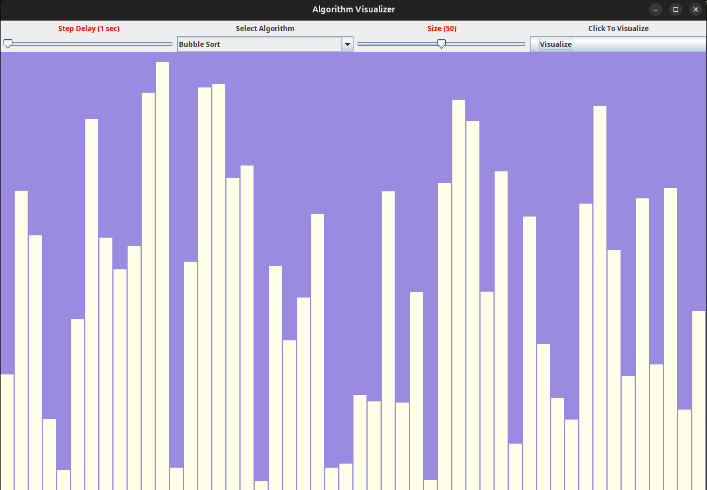
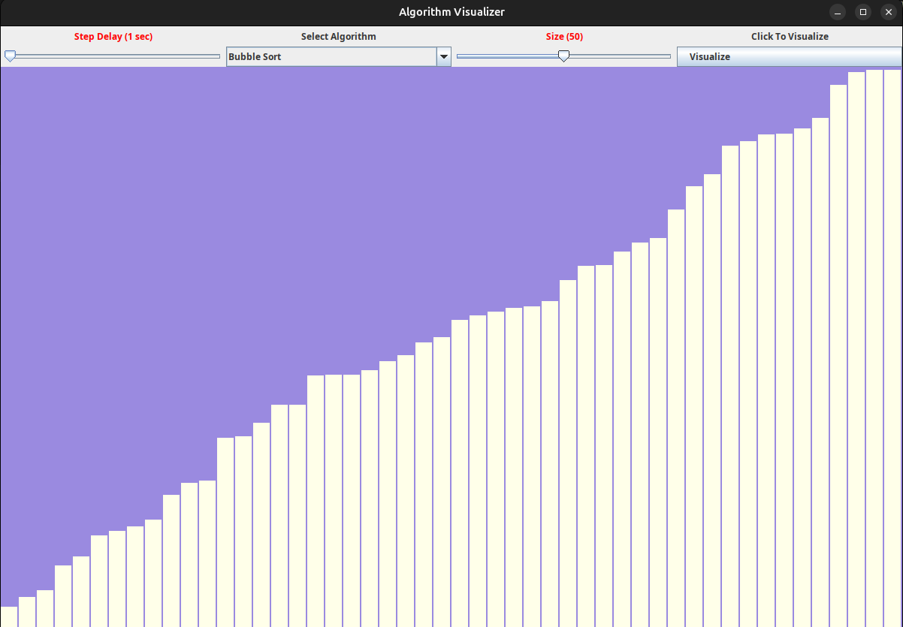

# Sorting Algorithm Visualizer
Algorithm Visualizer is a Java-based application that allows you to visualize popular sorting algorithms in real-time. The application provides an interactive GUI where users can adjust the number of elements, control the speed of the visualization, and choose from various sorting algorithms to see how they work.

## Features

- **Sorting Algorithms**: Visualize multiple sorting algorithms, including:
  - Bubble Sort
  - Selection Sort
  - Insertion Sort
  - Merge Sort
  - Quick Sort

- **Interactive Sliders**: 
  - Control the size of the array being sorted.
  - Adjust the delay between sorting steps to control visualization speed.

- **Responsive GUI**: The application uses `SwingWorker` to ensure smooth and responsive animations while visualizing the algorithms.

## Technologies Used

- **Java**: The core programming language used for the application logic and GUI components.
- **Swing**: A GUI toolkit for Java used to create the application's interface.
- **SwingWorker**: Used to perform long-running sorting tasks without freezing the GUI.

## How to Run

1. **Clone the Repository**:
   ```bash
   git clone https://github.com/amanbisht9/algoVisualizer.git
   cd algoVisualizer
   ```

2. **Run Application**:
   ```bash
   ./gradlew run
   ```

## Usage

1. **Select an Algorithm**:  
   Use the dropdown menu to choose the sorting algorithm you want to visualize (e.g., Bubble Sort, Merge Sort).

2. **Set Array Size**:  
   Adjust the slider labeled **Size** to choose the number of elements you want to sort. The default size is set to 50, but you can increase or decrease the size using the slider.

3. **Adjust Step Delay**:  
   Use the **Step Delay** slider to control the speed of the visualization. The step delay represents the time between visual updates. Increase the delay to slow down the visualization, or decrease it to speed things up.

4. **Start Visualization**:  
   Once you've selected the algorithm and adjusted the settings, click the **Visualize** button to start the sorting algorithm visualization. Watch as the bars representing array elements are sorted in real-time.

## Sorting Algorithms

### 1. Bubble Sort
- **Description**: Bubble Sort compares adjacent elements and swaps them if they are in the wrong order. This process repeats until the entire array is sorted.  
- **Time Complexity**: O(n²)

### 2. Selection Sort
- **Description**: Selection Sort finds the minimum element from the unsorted part of the array and swaps it with the first element in the unsorted part.  
- **Time Complexity**: O(n²)

### 3. Insertion Sort
- **Description**: Insertion Sort builds the sorted array one item at a time by inserting each element into its correct position.  
- **Time Complexity**: O(n²)

### 4. Merge Sort
- **Description**: Merge Sort is a divide-and-conquer algorithm that splits the array into smaller sub-arrays, sorts them individually, and then merges them back together to form the sorted array.  
- **Time Complexity**: O(n log n)

### 5. Quick Sort
- **Description**: Quick Sort picks a pivot element and partitions the array into two sub-arrays. Elements in the left sub-array are smaller than the pivot, and elements in the right sub-array are larger. This process is repeated recursively until the entire array is sorted.  
- **Time Complexity**: O(n log n)

## Screenshots
Include screenshots of the application here to give users a visual idea of the interface and how the sorting algorithms are visualized.
### Unsorted Visualization


### Sorted Visualization


## Future Enhancements

1. **Add More Sorting Algorithms**:  
   Implement other sorting algorithms such as Heap Sort, Radix Sort, and others for more diverse visualizations.

2. **Search Algorithm Visualization**:  
   Add visualizations for search algorithms like Binary Search and Linear Search to demonstrate how elements are found in arrays.

3. **User-Defined Arrays**:  
   Provide an option for users to manually enter their own array elements and visualize the sorting of custom data.

## Acknowledgements

- Inspired by various algorithm visualization projects that demonstrate the beauty and intricacies of sorting algorithms through real-time visual feedback.
- Built using **Java Swing** for the graphical user interface and **SwingWorker** for smooth handling of background tasks, ensuring that the UI remains responsive during long-running operations.
- Special thanks to the open-source community for providing guidance and resources that helped shape this project.